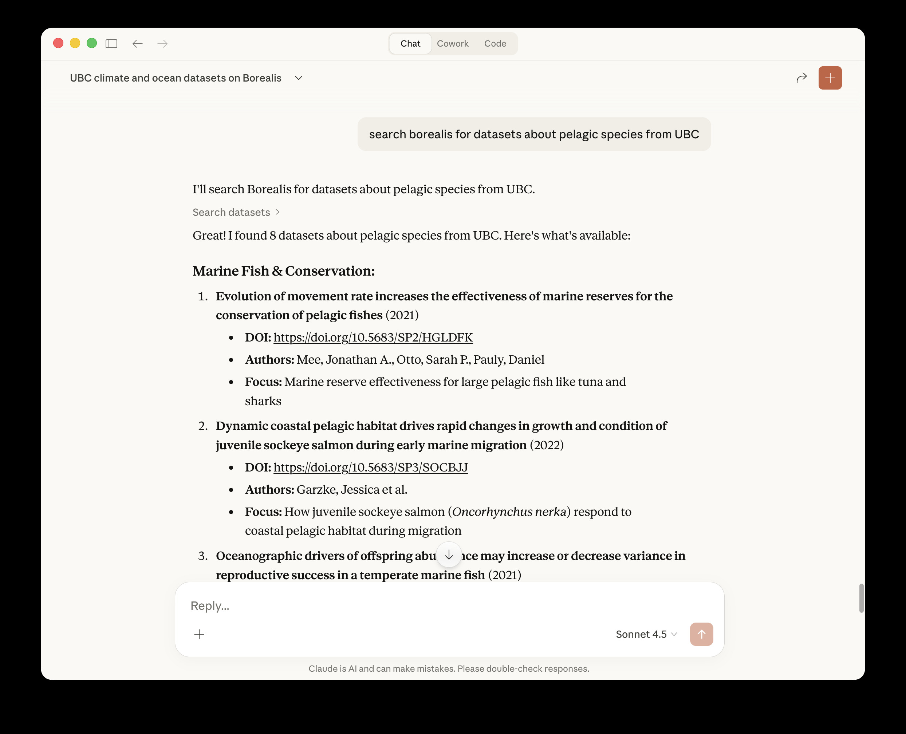
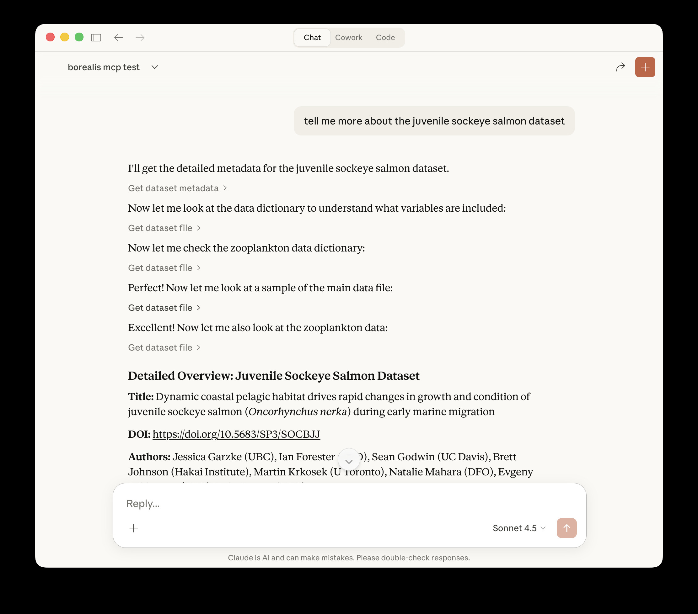
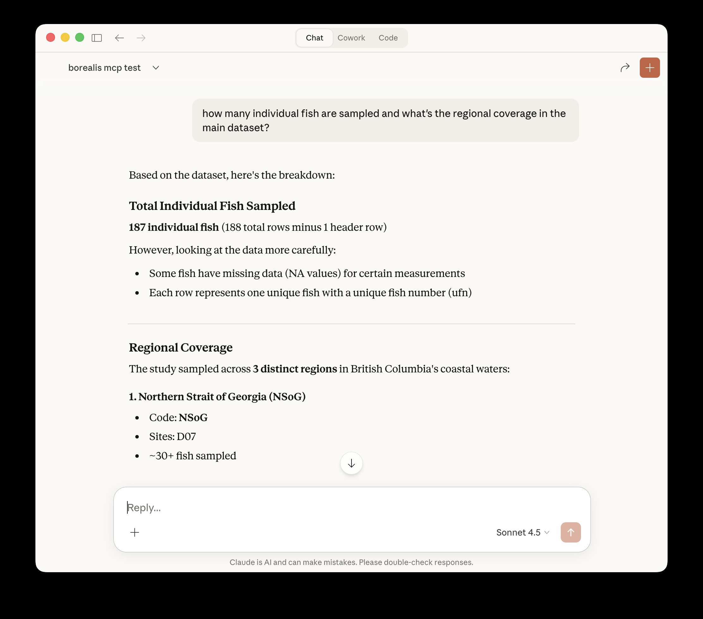

# Borealis Dataverse MCP Server

This is a personal experimentation project and a work in progress. It is a custom MCP (Model Context Protocol) server that runs locally and enables a tool like Claude Desktop to search the public [Borealis Dataverse](https://borealisdata.ca) - Canada's research data repository - directly from conversations.

**Note**: This MCP server was built with help from Claude for the Python parts.

 



## What It Does

This connector allows:
- Searching through research datasets from Canadian institutions
- Filtering results by specific institutions (70+ Canadian institutions supported)
- Filtering by geographic coverage (country, province/state, city that the data is about)
- Returning formatted results with titles, descriptions, DOI links, and authors
- Accessing both published and unpublished datasets (unpublished only with API key and access permissions)
- Retrieving dataset metadata when asking for more information about specific datasets
- Listing files within datasets with filtering and pagination
- Retrieving and viewing text-based dataset files directly in chat (under 5MB)

### Example Queries

- "Search Borealis for datasets about pollination"
- "Use my Borealis search tool to find datasets from UofT about bees"
- "Show me datasets from the last 5 years from UBC about forestry"
- "Find datasets about healthcare in Saskatchewan"
- "Tell me more about the SynPAIN dataset"
- "What files are in this dataset?"
- "Can we look at the readme file together?"

## Prerequisites

- Claude Desktop (Claude Desktop is used here in the instructions as an example)
- Python 3.7+
- A Borealis account and API key (optional - public searches work without authentication)

## Installation

### 1. Install Required Dependencies

```bash
pip install mcp httpx
```

### 2. Clone This Repository

```bash
git clone https://github.com/jesswhyte/borealis_dataverse_mcp.git
cd borealis_dataverse_mcp
```

### 3. Make the Server Executable

```bash
chmod +x borealis_server.py
```

### 4. Get Your Borealis API Key (Optional)

1. Go to https://borealisdata.ca
2. Log in or create an account
3. Navigate to your account settings
4. Generate an API token
5. Copy the token (format: `xxxxxxxx-xxxx-xxxx-xxxx-xxxxxxxxxxxx`)

### 5. Configure Claude Desktop

Edit your Claude Desktop configuration file, e.g. if you're on a Mac:

```bash
nano ~/Library/Application\ Support/Claude/claude_desktop_config.json
```

Add the following configuration (note you will need to change the path to borealis_server.py and edit your API key):

```json
{
  "mcpServers": {
    "borealis-dataverse": {
      "command": "python3",
      "args": [
        "/absolute/path/to/borealis_server.py"
      ],
      "env": {
        "BOREALIS_API_KEY": "your-api-key-here"
      }
    }
  }
}
```

**Important**: 
- Replace `/absolute/path/to/borealis_server.py` with the full path to your cloned repository
- Replace `your-api-key-here` with your actual Borealis API key
- If you don't have an API key, omit the `env` section entirely - public searches will still work

### 6. Restart Claude Desktop

- Quit Claude Desktop completely (⌘+Q)
- Reopen Claude Desktop

### 7. Verify Installation

Check the logs to confirm the server started successfully:

```bash
cat ~/Library/Logs/Claude/mcp*.log | grep borealis
```

You should see messages indicating the server started and connected.

### 8. Test It

Open a **new conversation** in Claude Desktop and try:

```
Search Borealis for datasets about pelagic species from UBC
```

## Usage

### Basic Search

```
Search Borealis for datasets about [your topic]
```

### Search by Institution

```
Find datasets from [Institution Name] about [topic]
```

Supported institution formats:
- Full names: "University of Toronto", "McGill University"
- Some short names: "UBC", "U of T"
- Common abbreviations: "UAlberta", "UWaterloo"

### Search by Geographic Coverage

```
Find datasets about [city/province/country]
```

Note: Geographic filters indicate what region the data is *about* (e.g., "datasets about Halifax"), not where the researchers are located.

### Get More Information

After viewing search results, you can ask for detailed metadata:

```
Tell me more about the [dataset name]
```

This retrieves metadata including descriptions, all authors with affiliations, keywords, license details, and file information.

### Options

The tool supports:
- **Number of results**: Request more or fewer results (max 100) in prompt
- **Sorting**: Sort by relevance (default), date (newest first), or name (alphabetical)
- **Type filtering**: Filter by dataset, dataverse, or file
- **Combined filters**: Mix university, geographic, and keyword filters in a single query

## Supported Institutions

Includes mappings for 70+ Canadian institutions. See `borealis_server.py` for the complete list.

## Tools Available

The MCP server has four tools:

### 1. search_datasets
Search for datasets

### 2. get_dataset_metadata
Retrieve metadata for a specific dataset

### 3. list_dataset_files
List all files in a specific dataset with support for:
- Pagination (limit and offset parameters)
- File type filtering (search by extension or filename)
- File metadata (size, type, access restrictions)
- MD5 checksums for verification
- File IDs for retrieval

### 4. get_dataset_file
Download and retrieve file content with intelligent handling:
- Text-based files only (CSV, TXT, DAT, R, Python, etc.)!!
- 5MB maximum file size for chat display
- Automatic line truncation (first 100 lines for long files)
- File format detection and validation
- Error messages for unsupported formats

## Architecture

### Components

- **Language**: Python 3
- **MCP SDK**: Official Python MCP library from Anthropic
- **HTTP Library**: httpx for async API calls
- **Configuration**: Environment variables and JSON config file

### How It Works

1. Receives a search or metadata request from the user
2. The MCP server translates institution names to dataverse identifiers and formats queries
3. The server queries the Borealis API with appropriate filters
4. Results are parsed and formatted
5. Returns structured results with DOI links and metadata

## Troubleshooting

### Server Not Connecting

**Give it a second or restart Claude**
Sometimes the MCP server doesn't start up fast enough, try restarting Claude and give it a second before attempting again. 

**Check the logs:**
For example...

```bash
cat ~/Library/Logs/Claude/mcp*.log | tail -50
```

**Common issues:**
- Verify the file path in your config is correct and absolute
- Ensure the Python file is executable (`chmod +x borealis_server.py`)
- Check that Python 3 is available: `which python3`

### API Authentication Errors

The server automatically falls back to public search if authentication fails. To verify your API key:

```bash
curl -H "X-Dataverse-key: YOUR_KEY" "https://borealisdata.ca/api/search?q=test"
```

### Tool Not Appearing

- Ensure you started a **new conversation** after restarting Claude Desktop
- MCP tools only load into conversations created after the server connects
- Check that the server shows as connected in Claude Desktop

## Development

### Extending the Server

To add additional tools:

1. Add the tool definition to `list_tools()`
2. Implement the handler function
3. Add the handler to `call_tool()`

See the Borealis API documentation for available endpoints: https://borealisdata.ca/guides/en/latest/api/

### Testing

Test the server directly:

```bash
cd /path/to/borealis-mcp-server
python3 borealis_server.py
```

The server should start and wait for input without errors.

## Technical Notes

- The server uses async/await for non-blocking API calls
- Authentication is optional; public searches work without an API key
- Institution name matching is case-insensitive
- The `subtree` parameter filters results to specific dataverses
- Geographic filters use the `fq` (filter query) parameter
- Results are limited to 100 per request (Borealis API limit)
- Metadata is retrieved in JSON-LD format and parsed for display
- It uses MCP’s stdio transport, so it talks over standard input and output instead of using HTTP. It must be started by an MCP-compatible host (for example, Claude Desktop) and does not run as an HTTP server, so it cannot be started with uvicorn or opened in a browser.

## Known Limitations

- Geographic filters indicate dataset subject matter, not researcher location
- Regional groupings (e.g., "Toronto-based research" spanning multiple institutions) not yet implemented
- Some MCP server startup timing issues may require restarting Claude Desktop

## Future Improvements

Areas for potential enhancement:

- Code refactoring (split this up into config, tools). It's a little unwieldy. 
- Regional institution groupings (e.g., all Toronto institutions)
- Broader file download capabilities
- Better error handling and user feedback
- Expanded geographic mappings
- Date range filtering
- Could add an HTTP based MCP interface so it works with OpenAI style connectors.

## License

GPLv3 

## Acknowledgments

- Built using the [Model Context Protocol](https://modelcontextprotocol.io/)
- Developed with a lot of assistance from Claude 
- Powered by [Borealis Dataverse](https://borealisdata.ca). Borealis has high quality metadata, a well-structured API, and clear documentation. The connector depends on that foundation.

## Support

For issues related to:
- **This MCP server**: Open an issue in this repository
- **Borealis API**: Visit https://borealisdata.ca/guides/
- **Claude Desktop**: Contact Anthropic support
- **MCP Protocol**: See https://modelcontextprotocol.io/

---
